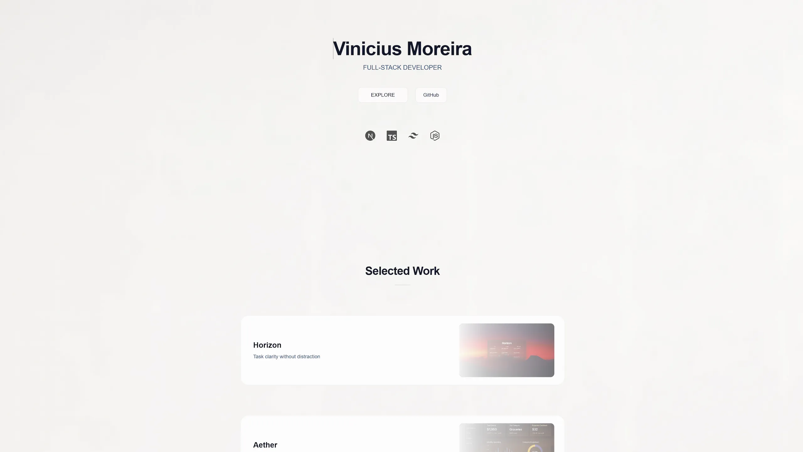

# Origin

---

## Overview

Origin is a lightweight portfolio surface built to present projects with clarity and consistency.  
Work is organized as finished systems, emphasizing layout, motion, and visual hierarchy over content volume.

View https://vmoreira.dev

---

## Design

- Minimal surface area  
- Strong visual hierarchy  
- Controlled motion and transitions  
- Project-first presentation  
- Designed to stay out of the way  

---

## Execution

- Next.js (App Router)  
- React  
- TypeScript  
- Tailwind CSS  
- Framer Motion  
- shadcn/ui  
- Vercel  
